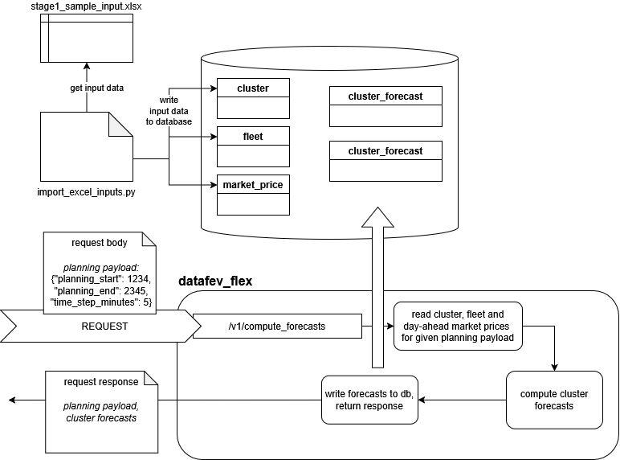

# datafev_flex with database

## Architecture and data flow
The diagram below visualizes an overview of the datafev_flex service running with database:

1. Upper part: Shows the tables which datafev_flex uses inside the database. Exemplary input data of the algorithm can be taken from an excel sheet by using the import script documented below.
2. Lower part: Visualizes the API request to datafev_flex using database. The request expects a planning payload. Inside the datafev_flex service, the database input tables are read accordingly, then the forecasts are computed. Results are written to the database output tables and are also returned inside the request response.





### Startup 
Startup the datafev_flex service with database:

```bash
export USER_ID="$(id -u)"
export GROUP_ID="$(id -g)"
docker compose -f docker-compose.test.yml up
```

### Populate 
Populate the database with input test data:
1. Activate [virtual environment](./README.md###using-virtualenv-(recommended))
2. Configure environment variables by copying the environment template file. The variables in the ```.env``` file will be read by load_dotenv(). The default values in the template will work with the docker compose file above:
```
cp .env.template .env
```
3. Run script to import input data from excel sheets into database:
```
python scripts/import_excel_inputs.py
```

### Local workflow
Run local workflow script using database:
```
python run_local_workflow.py
```


### Integration test
Run integration test for testing the endpoint which executes the flexibility service using database instead of excel:
```
pytest tests/integration/test_forecast_endpoint.py
```


### Teardown
Stop the database and datafev_flex services and remove their docker containers:
```
docker compose -f docker-compose.test.yml down
```
